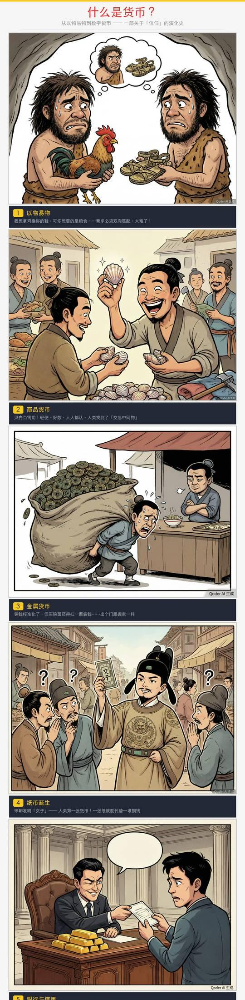
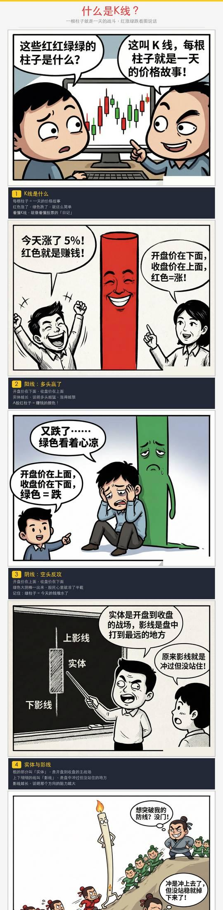

<p align="center">
  <strong>English</strong> | <a href="README.zh-CN.md">中文</a>
</p>

<p align="center">
  
  
  
</p>

# Comic Production Pipeline

> Generate educational comic strips in the style of **Hunzhi Comics (混知漫画)** — AI image generation + PIL assembly, producing long-form vertical comics with storytelling text bands.

## Examples

<p float="left" align="center">
  
  
  
</p>

<p align="center"><em>Left: What is Money &nbsp;|&nbsp; Center: What is Inflation &nbsp;|&nbsp; Right: What are Candlesticks</em></p>

## Quick Start

```bash
# Install as AI Agent Skill (Claude Code / QoderWork / Cursor)
cp -r . ~/.qoderwork/skills/comic-production   # QoderWork
cp -r . .claude/skills/comic-production         # Claude Code (project-level)

# Or install the Python dependency only
pip install Pillow
```

Then ask your AI agent:

> "帮我做一个关于通货膨胀的科普漫画"

## What is This?

This project is both a **standalone Python tool** and an **AI Agent Skill** for creating Chinese educational comics (科普漫画). It implements a 4-step pipeline:

```
1. Plan panels  →  2. Generate images (AI)  →  3. Assemble comic (PIL)  →  4. (Optional) Make video
```

Each panel is generated independently by an AI image generator (DALL-E, Midjourney, etc.), then assembled into a polished long-form vertical comic using the included PIL script. The output is optimized for mobile sharing (WeChat, social media).

**Key features:**

- Auto watermark removal from AI-generated images
- Dynamic text bands that expand based on content length
- Hunzhi-style storytelling format (scene → conflict → punchline)
- 1080px wide, mobile-friendly output
- No image cropping — text lives on separate bands below each panel

## Installation

### As an AI Agent Skill

| Platform | Install |
|----------|---------|
| **QoderWork** | `cp -r . ~/.qoderwork/skills/comic-production` |
| **Claude Code** (global) | `cp -r . ~/.claude/skills/comic-production` |
| **Claude Code** (project) | `cp -r . .claude/skills/comic-production` |
| **Cursor** | Copy `SKILL.md` to `.cursor/rules/comic-production.mdc` |

### As a Standalone Python Tool

```bash
pip install Pillow
python3 scripts/assemble.py --help
```

**Font requirements:** The script auto-detects CJK fonts on macOS (STHeiti, PingFang, Songti, Hiragino Sans). On Linux/Windows, install any CJK font and update `find_font()` in `assemble.py`.

## Usage

### With an AI Agent

After installing as a skill, the agent will automatically activate it when you ask to create educational comics. Try:

```
"帮我做一个关于量子力学的科普漫画"
"Create an educational comic about blockchain"
"用混知风格画一个讲股票K线的漫画"
```

### Standalone (Manual Pipeline)

**Step 1:** Generate panel images with any AI image generator using this prompt template:

```
A single-panel Chinese educational comic in the style of Hunzhi Comics.
Scene: [YOUR SCENE DESCRIPTION].
Character A's speech bubble: "中文对话".
Simple cartoon style with bold black outlines, flat bright colors, minimal background.
Exaggerated humorous facial expressions, big heads and small bodies.
```

Recommended size: 1024×768 (landscape, 4:3).

**Step 2:** Create `panels.json`:

```json
[
  {
    "image": "panels/panel_1.png",
    "title": "以物易物",
    "lines": [
      "我想拿鸡换你的鞋，可你想要粮食",
      "双方都得需要对方的东西，这买卖才能成",
      "需求必须双向匹配——太难了吧！"
    ]
  }
]
```

**Step 3:** Assemble:

```bash
python3 scripts/assemble.py \
  --title "什么是货币？" \
  --subtitle "从以物易物到数字货币" \
  --panels panels.json \
  --output comic.png \
  --output-jpg
```

### CLI Options

| Parameter | Default | Description |
|-----------|---------|-------------|
| `--width` | 1080 | Output width (px) |
| `--padding` | 40 | Horizontal margin (px) |
| `--text-band-h` | 95 | Min text band height (px) |
| `--title-h` | 180 | Title area height (px) |
| `--gap` | 10 | Gap between elements (px) |
| `--output-jpg` | flag | Also export JPG |

## How Skills Work

A skill is a folder containing a `SKILL.md` file that instructs AI coding agents how to perform specific tasks:

```
comic-production/
├── SKILL.md              # Agent instructions (YAML frontmatter + markdown)
├── scripts/
│   └── assemble.py       # PIL comic assembly script
├── examples/             # Sample outputs
├── README.md
└── LICENSE
```

The `SKILL.md` frontmatter tells the agent when to activate the skill:

```yaml
---
name: comic-production
description: "Generate educational comic strips in 混知漫画 style...
  Use when the user wants to create educational comics, 科普漫画,
  knowledge comics, or illustrated explainers."
---
```

## Project Structure

```
comic-production/
├── SKILL.md                 # AI Agent skill definition
├── scripts/
│   └── assemble.py          # PIL-based comic assembly (249 lines)
├── examples/
│   ├── example_money.jpg    # What is Money
│   ├── example_inflation.jpg# What is Inflation
│   └── example_kline.jpg    # What are Candlesticks
├── README.md                # English documentation
├── README.zh-CN.md          # 中文文档
├── LICENSE                  # MIT
└── .gitignore
```

## Storytelling Principles

The key to great educational comics is **storytelling**, not textbook definitions:

1. **Use analogies and metaphors** — never quote textbook definitions
2. **Tell it like a story to a friend** — not like a lecture
3. **Create mini-scenes** — "Imagine a village of 100 people, each given 100 yuan..."
4. **Use humor, rhetorical questions, dramatic contrast**
5. **Last line = golden quote / punchline** — make it memorable

**Good:**

```json
{
  "title": "什么是通胀",
  "lines": [
    "假设全村100人，每人发100块",
    "可村里只有一头牛……你猜牛能卖多少钱？",
    "钱多了，东西没多 = 通胀"
  ]
}
```

**Bad (avoid):**

```json
{"title": "什么是通胀", "description": "货币供应量超过商品供应量导致物价上涨"}
```

## Design Spec

### Layout

```
┌─────────────────────────────┐
│        Title Area           │
├─────────────────────────────┤
│     Panel 1 Image           │  ← AI-generated, watermark auto-removed
├─────────────────────────────┤
│ ① Panel Title (yellow)      │  ← Dark text band (dynamic height)
│ Story line 1...             │
│ Story line 2...             │
│ Punchline...                │
├─────────────────────────────┤
│     Panel 2 Image           │
├─────────────────────────────┤
│ ② Panel Title               │
│ Story lines...              │
└─────────────────────────────┘
```

### Color Palette

| Element | Hex | Preview |
|---------|-----|---------|
| Background | `#F5F5F5` | 🟫 |
| Text band | `#232837` | ⬛ |
| Title text | `#E63C3C` | 🟥 |
| Panel title | `#FAC81E` | 🟨 |
| Body text | `#C8C8C8` | 🔘 |

### Panel Count Guide

| Topic Depth | Panels |
|-------------|--------|
| Simple | 6 |
| Standard | 8 (recommended) |
| Deep dive | 10 |

## Contributing

Contributions are welcome! Feel free to:

- Add support for more CJK fonts (Linux/Windows)
- Improve the watermark removal algorithm
- Add new layout templates (horizontal, grid, etc.)
- Translate the storytelling guide to other languages

## License

[MIT](LICENSE) — free for personal and commercial use.
